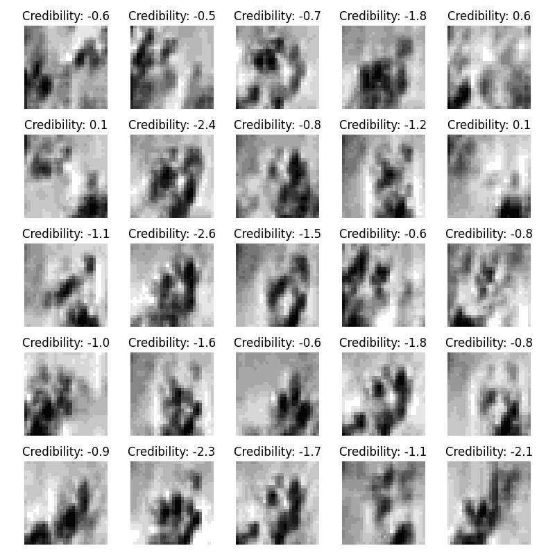

# Inspired by geohott, this is my repo containing some implementations of AI models trained on simple datasets in notebooks.

If you want me to try something else you tried yourself and found you learnt a lot by doing so, feel free to create an issue with the idea and I'll make it if it's reasonable.

### I've so far implement the following in this repo:
- DCGAN on the MNIST Dataset (MNIST_DCGAN.ipynb) 
- Wasserstein-DCGAN with Gradient Penalty on the MNIST Dataset (MNIST_WDCGAN-GP.ipynb)
- Self-attention-Wasserstein-DCGAN with Gradient Penalty on the HANDMNIST Dataset (HAND_Attention-WDCGAN-GP.ipynb)

- Pix2Pix on a Satellite <-> Google map images dataset (SATELLITE_PIX2PIX.ipynb)
